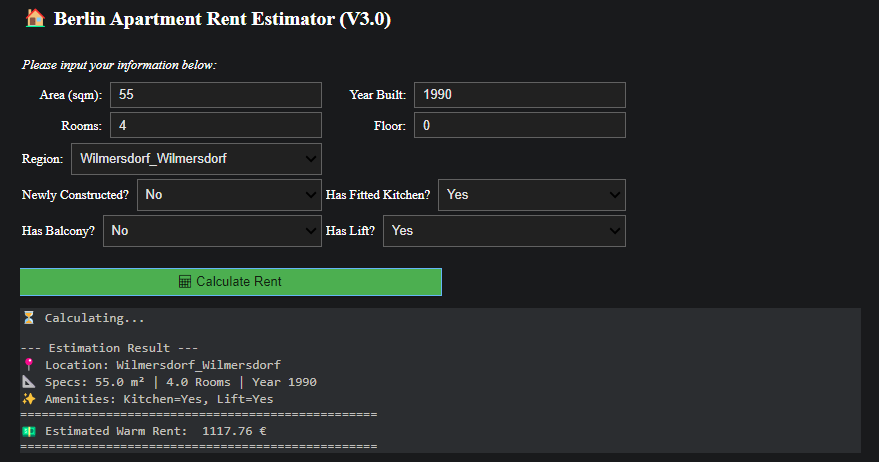
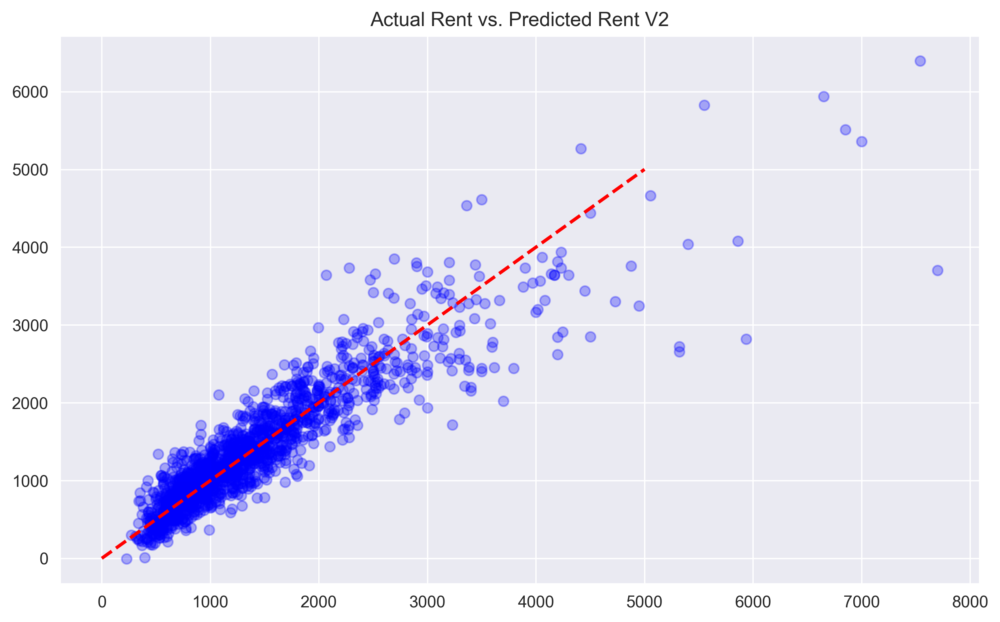

# 🏠 Berlin Apartment Rent Estimator (V3.0)

> An interactive Machine Learning tool for predicting Berlin apartment rents (Warmmiete), achieving **84% R² accuracy**.

### 1. Project Overview 
As an architect based in Germany transitioning into data science, I developed this end-to-end Machine Learning project to decode the complex Berlin rental market. 

Unlike standard tutorials, this project leverages **architectural domain knowledge** to perform deep feature engineering—quantifying the real value of "Altbau", specific "Kiez" (neighborhood) premiums, and amenities like fitted kitchens.

### 2. UI Demo 
I developed an interactive GUI using `ipywidgets`. Users can input apartment specifications (Area, Year, Location, Amenities) and get a real-time rent estimation based on the AI model.


*(Fig 1: The Interactive Rent Calculator)*

### 3. Key Features & Insights 
Data analysis revealed the hidden value of architectural features:
*   **Location Premium:** The model captures micro-location value. For example, **Mitte** is ~600€ more expensive than Marzahn for the same apartment.
*   **Altbau Effect:** Old buildings (pre-1949) carry a significant "charm premium" (~230€), outweighing their potential energy inefficiency.
*   **Kitchen ROI:** Installing a fitted kitchen increases the monthly rent valuation by **~117€** (net premium after adjusting for location), suggesting a payback period of ~34 months.

### 4. Model Performance 
*   **Algorithm:** Linear Regression (Optimized with One-Hot Encoding)
*   **R² Score:** **84.06%**
*   **MAE (Mean Absolute Error):** ±220 €

Below is the comparison between Actual Rent vs. Predicted Rent. The alignment along the red dashed line indicates high prediction accuracy for typical apartments.



### 5. Tech Stack 
*   **Core:** Python, Pandas, NumPy
*   **Visualization:** Matplotlib, Seaborn
*   **Machine Learning:** Scikit-Learn
*   **UI/Interaction:** Ipywidgets

### 6. How to Run
1. Clone the repository.
2. Install dependencies:
   ```bash
   pip install -r requirements.txt

3. Open Berlin_Rent_Project_publish.ipynb in Jupyter Notebook or PyCharm.
4. Run all cells to train the model and launch the UI.

---
Data Source: Kaggle (Apartment rental offers in Germany)
